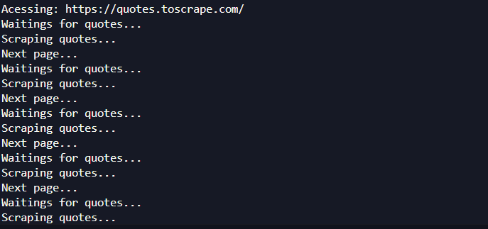
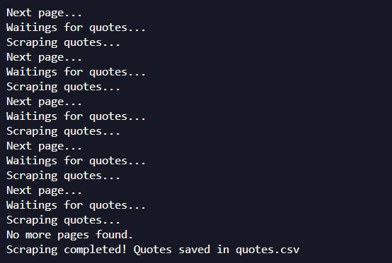
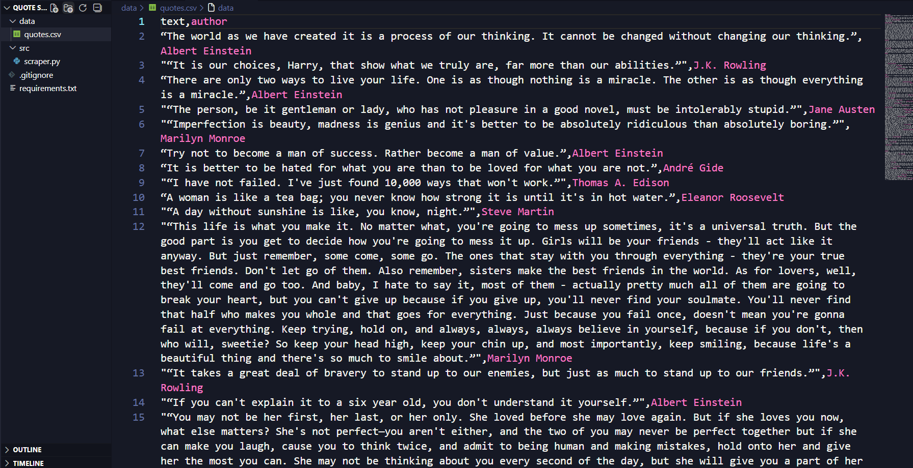

# quote-scraper

A simple and clean web automation project built with **Playwright**.  
The script navigates through all pages of https://quotes.toscrape.com, extracts every quote and author, and saves the data into a CSV file.

This project is designed as a beginner-friendly example of:
- Playwright automation (sync mode,bcause dont need async)
- Pagination handling
- Structured data extraction
- Clean project organization
- Automatic waiting for elements

---

## Features

- Fast browser automation (Playwright)
- Automatic waiting (no sleeps needed)
- Pagination support  
- Export to CSV  
- Organized project structure  
- Stable scraping (no random crashes)

---

## Project Structure

```
project/
│
├── data/
│   └── quotes.csv              # generated automatically after running
│
├── docs/
│   └── screenshots/
│       ├── 1_running.png
│       ├── 2_pagination.png
│       └── 3_result.png
│
├── src/
│   └── scraper.py
│
├── requirements.txt
└── .gitignore
```

---

## How It Works

1. `scraper.py` launches a Chromium browser using Playwright (sync API).  
2. The script loads the website, waits for quotes to appear, extracts all quotes from the page, and follows pagination until the last page.  
3. All collected data is saved into `./data/quotes.csv`.

---

## Installation

### 1. Clone the repository

```bash
git clone https://github.com/Yllodido3d/quote-scraper-with-playwright.git
```

### 2. Install dependencies

```bash
pip install -r requirements.txt
```

### 3. Install Playwright browsers

```bash
playwright install
```

---

## Running the Scraper

From the project root:

```bash
python src/scraper.py
```

The CSV file will be created at:

```
data/quotes.csv
```

---

## Example Output (CSV)

```
"text","author"
"The world as we have created it is a process of our thinking.","Albert Einstein"
"It is our choices, Harry, that show what we truly are.","J.K. Rowling"
...
```

---

## Screenshots

### Running the scraper


### Pagination working


### Final output (CSV)


                           ^
first time using prints :> |
---

## Notes

- Playwright handles browser installation automatically using `playwright install`.  
- The scraper runs **with UI visible** (`headless=False`) for learning purposes, but you can switch to headless mode easily.  
- The project follows a clean folder structure to keep code, data, and documentation organized.

---

## License

MIT License – feel free to modify or use this project as part of your portfolio.

